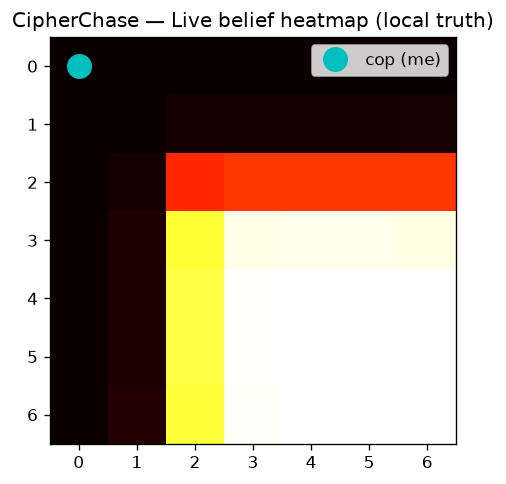
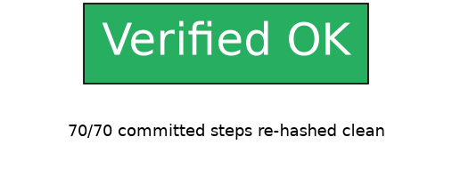
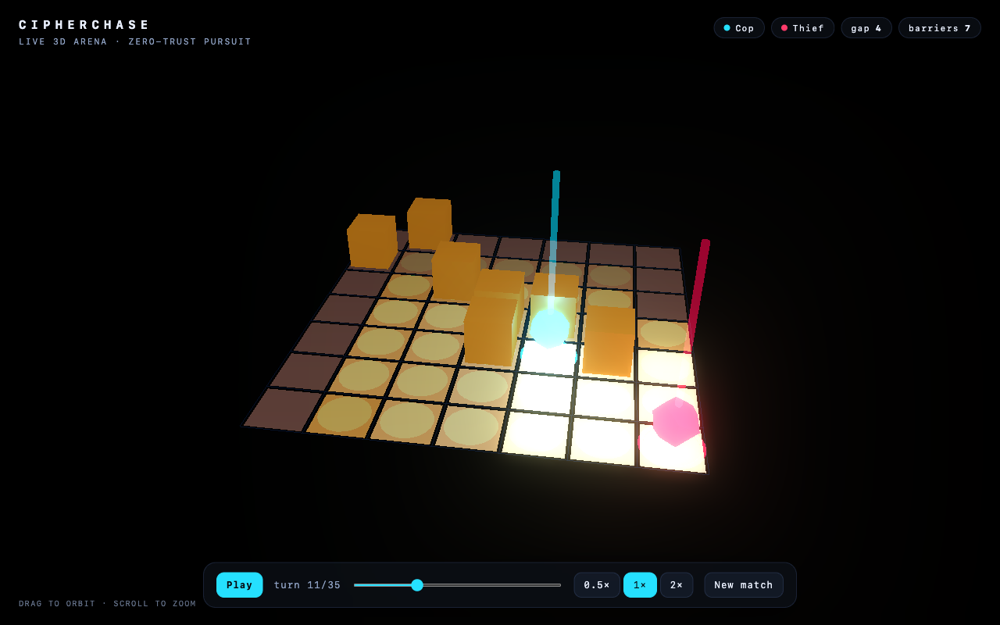
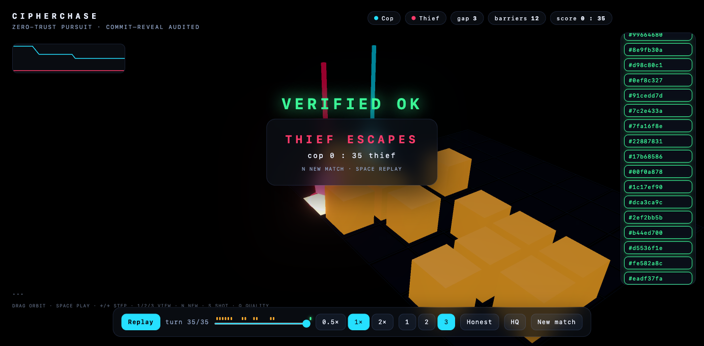
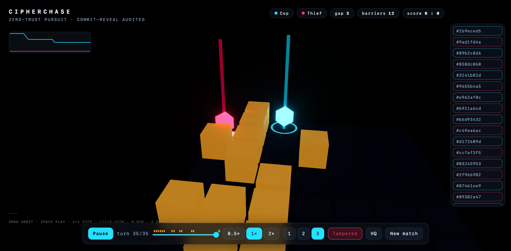
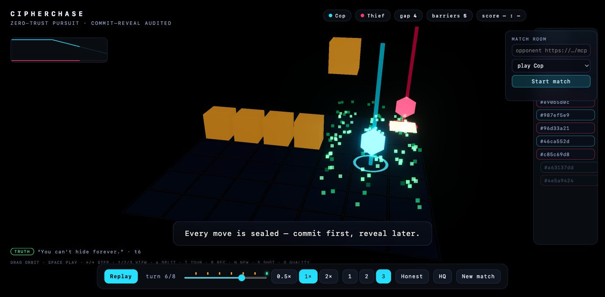
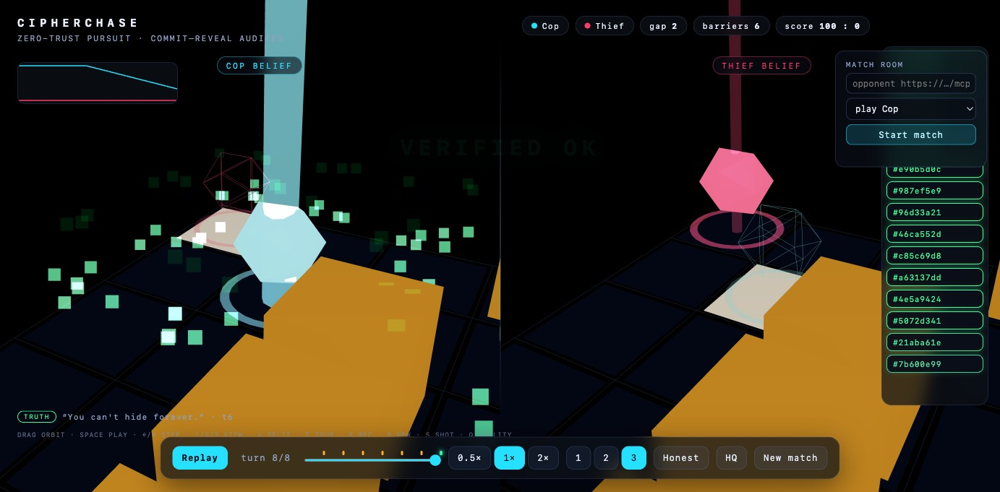
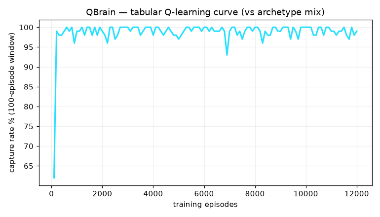

# CipherChase — Distributed Cops-and-Robbers over a Peer-to-Peer Network

> **Final Project · Course 203.3763 "Orchestration of AI Agents"** · University of Haifa · Spring 2026 · Dr. Yoram Segal
> **Team `uoh-sqak`** — Salah Qadah (323039974) + Andalus Kalash (211435797)
> Paired repository (role-swapped): **[`uoh-sqak-cop`](https://github.com/salah-dev-stu/uoh-sqak-cop) ⇄ [`uoh-sqak-thief`](https://github.com/salah-dev-stu/uoh-sqak-thief)**

Two mutually-distrustful autonomous agents — a **Cop** and a **Thief** — chase on a **7×7** grid over a
**peer-to-peer FastMCP** network with **no central judge**. Each agent is *simultaneously a server and a
client*, plays under **partial observation** (Dec-POMDP), and exchanges **natural-language hints that may
lie**. Because nobody is trusted, fairness is enforced **cryptographically** (Commit-Reveal + SHA-256 +
end-of-game mutual audit): any tamper or false board claim yields an automatic **0/0** by mathematics. The
move brain is **pure Python** — the game runs to completion at **zero LLM tokens**; the LLM only writes bluff text.

## Mandatory screenshots (F12)

| Live GUI — local belief heatmap | Replay Viewer — integrity check |
|---|---|
|  |  |

The Live GUI shows **only this peer's belief** (never the objective board). The Replay Viewer re-hashes every
committed step of a logged game → green **"Verified OK"** / red **"TAMPERED"**. Above: the committed sample
run (`docs/sample-run/`) re-verifies clean on all 70 steps.

## Quick start (uv only — no keys, no live peer needed)

```bash
uv sync --dev                                   # Python 3.13 venv, all deps
uv run pytest                                   # 397 tests (395 run + 2 interop-gated), 100% coverage (~6 min)
uv run ruff check .                             # 0 findings
uv run python scripts/check_file_lines.py       # every .py ≤150 lines (raw AND logical)

# Play a full offline game → the 4 signed JSON reports:
uv run cipherchase self-match --config config/police --out logs
# Re-verify a logged game in the Replay Viewer (Tkinter):
uv run cipherchase replay --log docs/sample-run/log_uoh-sqak-police-02da547b_g01.json
# One-command integrity audit of ANY log — ours or an opponent's emailed report.
# Re-hashes every sealed record AND replays the moves on the board (a hash-valid
# but physically illegal log is convicted too); exit 1 + the exact record on tamper:
uv run cipherchase verify --log docs/sample-run/log_uoh-sqak-police-02da547b_g01.json
```

A committed **sample run** lives in `docs/sample-run/` as offline proof — the grader needs no API key, no
credentials, and no opponent. It carries **both sides of one game**: the police AND thief artifact quartets
(8 signed JSON), with identical sealed records and a **byte-identical symmetric mutual signature** — the
"both sides send or neither is scored" evidence, demonstrated, not asserted. Regenerate it any time with
`uv run python scripts/make_sample_run.py` (seeded — same config, same game).

## The Masterclass 3D Arena



Watch a match unfold in **interactive 3D** — and watch the *cryptography* referee it. The right-hand
**evidence rail** collects every move's sealed commit hash as the game plays; at the end an **audit wave**
re-verifies them chip by chip:

| Honest game — the wave runs green | A forged log — real crypto catches it |
|---|---|
|  |  |

```bash
uv run python scripts/viz_server.py     # → http://localhost:8777
```

- **Three views** (keys 1/2/3): *Cop view* (only what the cop knows — the thief is a ghost at the belief
  peak), *Thief view*, *Truth view* (both agents + a belief-error ribbon).
- **Honest/Tampered toggle** — the tampered replay is machine-forged (`scripts/make_tampered_replay.py`) and
  re-verified by the SAME `CommitReveal` the peers use: the forged chip flips red, the rail shatters,
  **"TAMPERED — match void 0/0"**.
- Follow-cam with orbit override, particle scent wake, wall-slam barriers, capture/survival finales, event
  markers + distance/belief-error sparkline, click any chip for its real payload/nonce/commit, `S` for a
  screenshot, quality toggle, reduced-motion respected.
- Zero build step: vendored Three.js ES modules, every arena file ≤150 lines, pure logic covered by
  `node --test viz/test/` in CI. **"New match"** runs a fresh game through the real engine.

#### Showtime — guided tour · split-screen · live league matches

| Guided tour (`T`) + match room | Split-screen dual-belief (`4`) |
|---|---|
|  |  |

- **Guided tour** (`T`) — a scripted ~25 s camera flight with film-style captions (board → scent wake →
  belief floor → sealed-chips rail → audit finale) that **records itself** to `tour.webm` via `MediaRecorder`.
  `Esc` cancels; reduced-motion keeps the captions and drops the flight.
- **Split-screen** (`4`) — both agents' minds at once: the cop's belief world (left) beside the thief's
  (right), one scene double-rendered into two scissor viewports; `1/2/3` exits.
- **Live match room (F14)** — start a **real league match** against a peer's `/mcp` URL from the panel and
  watch it stream live in 3D. The arena consumes **own-knowledge frames only** (own position, own belief,
  known barriers, last received hint, 8-hex commit head — *never* opponent truth, nonce, or sealed payload:
  a test greps the whole stream to prove it). `PeerRuntime` emits frames through an optional listener;
  `scripts/viz_server.py` (127.0.0.1-only) exposes `GET /api/spectate` + `POST /api/match`, one match at a
  time. Started from the arena, no keys required.

---

## Academic report

### 1. Dec-POMDP model
Two agents (`n=2`) on a 7×7 grid under **partial observation**. Neither sees the other's coordinates; each
maintains a **Bayesian belief** (`domain/belief.py`) over the opponent's cell, updated from the opponent's
**scent field** (physical, cannot lie) and from exclusions, then diffused each turn to model motion. Actions
are `N/S/E/W/STAY`; the Cop additionally places barriers. Rewards (from `game.json`): capture 20/5, survival
5/10, tie 2, technical-loss 0/0, diversity 10. This is a zero-sum pursuit-evasion Dec-POMDP.

### 2. FastMCP coordination
Each peer runs **its own FastMCP HTTP server** (`infra/mcp_server.py`) exposing exactly four interop tools —
`negotiate / receive_turn / submit_audit / receive_control` — and an **MCP client** (`infra/mcp_client.py`)
to the opponent's URL. Inbound messages land in **thread-safe bounded queues** (queue-not-drop backpressure),
never processed inline. A DRY `BaseTransport` lets an in-memory `FakeTransport` drive full loopback matches in
tests with no socket. Coordination is stateful via a **legal-transition state machine** + **deadline tracker**
+ **watchdog** (`peer/`), so a silent peer becomes a technical loss, never a hang. A **signed control
channel** (`peer/control_link.py`) carries the spec's bidirectional `enable`/`status`/`restart`/`quit`
overlay — reference-wire-compatible, with an auto-approved whole-series restart — and goes one step further
than the reference: **every control message, sent and received, is commit-sealed into the audit book**, so
"you paused", "you stalled", "you quit" are checkable claims, not arguments. Every external call —
MCP, LLM, Gmail, subprocess — is routed through one **`ApiGatekeeper.execute()`** (token-bucket + 429 retry +
ledger). **Interop is proven, not claimed — twice.** (1) CI clones the public reference implementation
([`rmisegal/Game-P2P-Cop-Chase`](https://github.com/rmisegal/Game-P2P-Cop-Chase)) on **every commit** and a
tripwire feeds our wire bytes to the reference's own strict parser, crypto verifier, and negotiation checker.
(2) Independently, our bytes are certified against the **Cop-Thief League Interop Kit**
(teams ImreEyal + anrbj666): all four CORE fixtures — canonical JSON, commit-reveal seal,
agreement signature, and `game_uid`/`game_id` derivation — reproduce exactly, vendored into our
suite at `tests/interop/league_vectors/` so CI re-proves it on every commit. That matters because
the audit is *mutual*: the opponent re-hashes our log with their code, and two honest peers whose
canonical JSON differs by one escaped character both score 0/0. (3) A full **two-process LIVE series** against the reference peer — roles swapping, both sides' audits
**verified** — reproduces locally in ~20 s:

```bash
git clone --depth 1 https://github.com/rmisegal/Game-P2P-Cop-Chase ../reference-repo
CIPHERCHASE_INTEROP=1 uv run pytest tests/interop/ -q --no-cov
```

### 3. Strategy (the graded brain)
Movement is **always algorithmic** (`strategy/`, behind a `BrainBase` seam swappable by config) — the LLM
never decides a move. The brain wins in **two layers**.

**Layer 1 — localise.** The **ScentDecoder** (`domain/scent_decode.py`) is a matched filter over the
opponent's broadcast scent field — predict `τ_t = min(1,(1−ρ)τ_{t−1}+D_c)` for every candidate centre, take
the best L1 fit — which recovers the opponent's cell **exactly** from legal information, even when the trail
saturates (0% → exact belief).

**Layer 2 — exploit.** An oracle location is *not* a capture: a greedy pursuer of an equal-speed evader can
**never** corner it (move-parity), which is why plain pursuit caps at ~27% against strategic thieves *even
with near-perfect belief*. **`ApexCop`** (`strategy/apex_cop.py`) breaks that ceiling with an **exact depth-8
alpha-beta endgame solver** (the thief plays *all* replies — a guarantee, not a prediction) that plays proven
forced-capture lines when the thief is walled near an edge, falling back to a **best-response** step that
minimises the thief's worst-case escape value over the reply set of a **league-robust ensemble opponent
model** (`strategy/opponent_model.py`). Measured (`scripts/benchmark_lab.py`, N=60/cell, 95% Wilson CI —
committed output incl. all four cops + an Elo ladder: [`analysis/benchmark_results.md`](analysis/benchmark_results.md)):

| cop \ thief | ThiefBrain | EvaderV2 | NaiveEdge | Random | Still |
|---|---|---|---|---|---|
| greedy `PoliceBrain` + decoder | 27 | 23 | **85** | 97 | 100 |
| **`ApexCop` + decoder** (default) | **95** | **77** | 55 | 97 | 100 |

The two *strategic* thieves go **27 → 95%** and **23 → 77%**; the one honest soft spot (NaiveEdge, a
non-strategic edge-walker where greedy's incidental barriers happen to win) is reported, not hidden. Two
further layers ride the same seam: a **Bayesian bluff-fusion** channel (`domain/hint_belief.py`, a Beta
honesty posterior calibrated online against observed moves) and **strategic deception** (`strategy/deception.py`,
a *rule* — never the LLM — decides when to lie). Cheap and clever — **Computational Fairness** on an 8 GB
laptop at zero tokens. One canonical-JSON implementation backs the commit hash, `config_sha256`, and mutual
signature for byte-identical interop.

### 4. Search & learning
The containment-to-capture gap is closed by **search**: `ApexCop` ships an exact alpha-beta endgame solver
plus one-ply best-response over an opponent model (§3) — the lookahead that a greedy pursuer provably lacks.

A **tabular Q-learning** cop (`strategy/qbrain.py`, 49 relative states × 5 moves, `scripts/train_qbrain.py`)
is the learning seam, swappable via `police_class` + `qbrain_policy_path`. Its curve is the artifact:



Trained vs the capturable archetypes it climbs from ~62% to **~99%** capture and then plays them perfectly —
but against a *strategic* equal-speed evader with no barriers the capture rate is a flat **0%** by move-parity,
no matter how long it trains. That is the thesis in one image: **learning masters what is learnable, and
`ApexCop`'s search (barriers + endgame proof) is what breaks the parity wall** the Q-cop cannot. Depth-limited
expectimax (`strategy/police_expectimax.py`) is a further comparison seam. Every claim is backed by the seeded,
CI-bounded benchmark (§3), not asserted.

### 5. Fairness & integrity (why P2P works without a judge)
`commit = SHA256(canonical_json({step,state,move,intent}) + "|" + nonce)` with a `secrets` nonce, verified in
constant time. This isn't asserted, it's *swept*: an exhaustive tamper sweep (`tests/integrity/`) perturbs
every single field of the committed 70-step log one at a time — **1807 mutations, 1807 caught**, each
localised to its exact record, zero escapes. Each move is **committed** (move hidden) → **revealed** → and every nonce is disclosed only at
the **end-of-game mutual audit**, which re-hashes both logs; any mismatch → `tamper_forfeit` 0/0. A **Step-0
signed declaration** binds hardware + LLM model + the per-game GitHub commit. Reports carry a **symmetric
mutual signature** (identical on both peers). The bluff hint may lie; the physical board may not — that
asymmetry is what the audit enforces. And it holds under live attack: a **Byzantine harness**
(`tests/integrity/test_byzantine.py`) plays real games against scripted cheater peers — a forged audit is
convicted and forfeited **localised to the doctored record**, a mid-game replay flood changes nothing
(idempotence), an oversized 600-word hint neither crashes nor stalls. Any log — including an opponent's
emailed report — re-audits offline in one command: `cipherchase verify --log <file>`.

### 6. Paired repository
One codebase, two league repos (D1/F14): **[`uoh-sqak-cop`](https://github.com/salah-dev-stu/uoh-sqak-cop)** ⇄
**[`uoh-sqak-thief`](https://github.com/salah-dev-stu/uoh-sqak-thief)** — identical code, the role is chosen at
launch (`cipherchase peer --role police|thief --config config/<role>`), so both repos stay byte-in-sync by
construction (`scripts/publish_repos.sh` pushes the same `main` + `v1.0-submission` tag to both remotes).

---

## Architecture & docs
- `docs/PRD.md` — product requirements (FR/NFR IDs, F1–F14 + R1–R13 traceability)
- `docs/PLAN.md` — **C4 model + UML + state machine + 11 ADRs** + the frozen interop contract (§8)
- `docs/PRD_*.md` — the 7 per-mechanism PRDs (one per build stage)
- `docs/TODO.md` — 622 TDD tasks + coverage matrices · `docs/PROMPTS.md` — prompt book
- `docs/deploy-tunnel.md` — ngrok/Localtonet runbook (F13) · `docs/RESEARCH-REPORT-Performance-Analysis.md`

## Engineering standards
Built bottom-up through **7 stages**, strict **TDD** (Red-Green-Refactor), **continuous commits**. Every file
**≤150 lines** (raw *and* logical), **ruff = 0**, **pytest --cov = 100%** (LLM + MCP + Gmail all mocked),
**zero hardcoded** values (all from `config/`), **zero secrets** (`.env-example` only), **`uv` only**, and a
**Python-3.13 CI** running ruff + line-check + version-sync + coverage on every push.

## Layout
```
src/cipherchase/  cli · constants · exceptions
  ├─ domain/    board rules scoring own_state · belief smell scent_decode hint_belief · crypto canonical · protocol negotiation game_ids · brains
  ├─ strategy/  factory · police_heuristic apex_cop opponent_model endgame · thief_heuristic thief_evader_v2 archetypes · deception trash_talk   (the graded seam)
  ├─ analysis/  stats (Wilson CI + Elo)
  ├─ peer/      orchestrator state_machine deadline watchdog · handshake sealing turn_sender turn_handler summary declaration
  ├─ infra/     mcp_server mcp_client transport_base inboxes · llm_provider · email_sender
  ├─ report/    schemas artifacts mutual_signature emit
  ├─ shared/    config gatekeeper rate_limiter sysinfo version
  ├─ sdk/       sdk (single entry) · game_loop · spectate live_match   (F14 live stream)
  └─ gui/       window (heatmap) · replay (verifier) · heatmap replay_data
config/{police,thief}/  game.json (signed, byte-identical) · game.toml (private, role-swapped) · rate_limits.json
```
