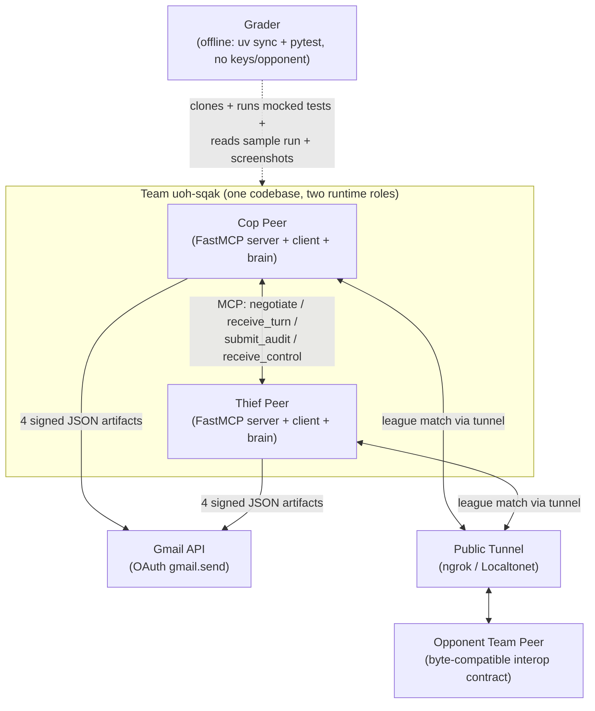
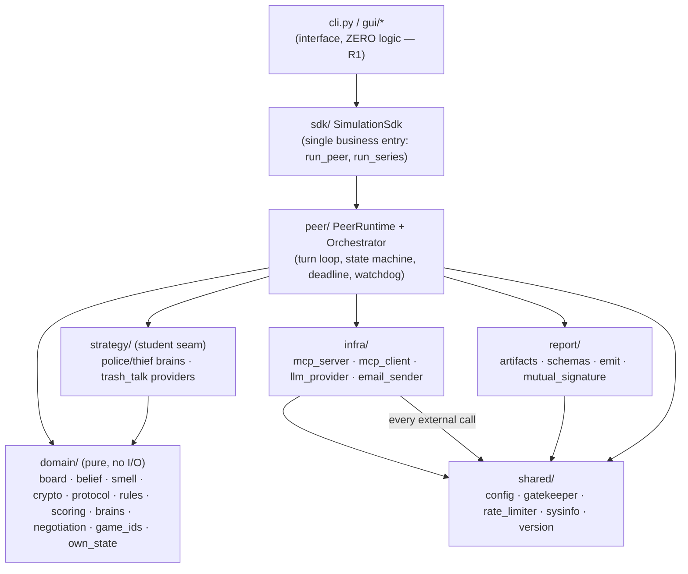
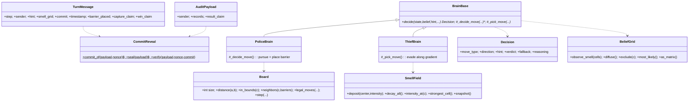
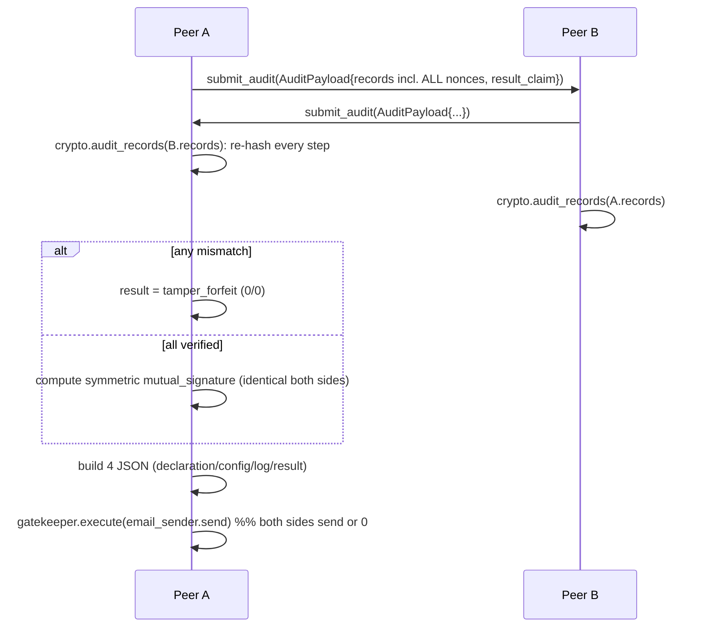
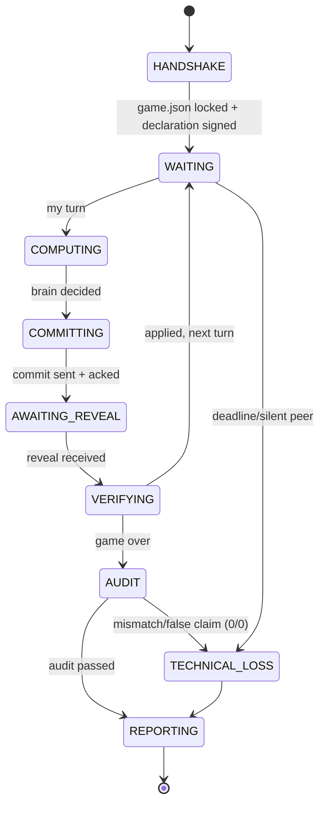

# PLAN — CipherChase Architecture (C4 · UML · ADRs)

> Companion to `docs/PRD.md`. Fixes the architecture, module/class inventory, control/data flows, and the decisions of record (ADRs) that the **7 per-mechanism PRDs** and `docs/TODO.md` derive from. Mirrors the reference `police_thief` layering with our own names and a clean TDD reimplementation. **We do not start from the reference.**

- **Package:** `cipherchase` · **Version:** 1.00 (single-source `shared/version.py`)
- **Diagram notation:** Mermaid (C4-style + class + sequence + state). All numbers are config-driven (Appendix ו), never literals in code.

---

## 1. C4 Level 1 — System Context



**Zero-trust boundary:** Cop and Thief are *separate OS processes with separate config dirs and no shared memory* (F2). Correctness across the trust boundary is enforced by Commit-Reveal + mutual audit (F3/F4), not by trusting the peer.

## 2. C4 Level 2 — Containers (inside ONE peer process)



**Dependency rule:** arrows point inward toward `domain` (pure) and `shared` (cross-cutting). `domain` imports nothing from `infra`/`peer`/`gui`. Every outward call (LLM, MCP, Gmail, subprocess) is routed through `shared/gatekeeper.py` (R3/NFR-3).

## 3. C4 Level 3 — Component & module inventory (target files, each ≤150 lines raw+logical)

> **Inventory status (2026-07-19):** the live-runtime set (`peer/runtime.py`, `sdk/series.py`) now ships.
> `talk_providers.py` was folded into `infra/llm_provider.py` + `strategy/trash_talk.py` (same seam, fewer
> files). Phenomenal-phase modules added beyond this baseline inventory: **strategy/** `apex_cop`,
> `opponent_model`, `endgame`, `police_herder`, `police_expectimax`, `thief_evader_v2`, `archetypes`,
> `deception`; **domain/** `scent_decode`, `hint_belief`; **analysis/** `stats` (Wilson CI + Elo); **sdk/**
> `game_loop`, `step0`, `spectate`, `live_match` (F14 live stream). This note supersedes any unqualified claim
> below.

> Small-module discipline is a *design output*, not an afterthought — each file has one purpose so it fits R8 and is independently testable (NFR-7/8).

### `cipherchase/` (top level)
`__init__.py` · `__main__.py` · `cli.py` (arg parse → SDK) · `constants.py` (enum names / non-config literals only) · `exceptions.py` · `py.typed`

### `domain/` — pure game logic (no I/O)
| Module | Responsibility |
|---|---|
| `board.py` | 7×7 geometry: `Board.distance/in_bounds/neighbors/legal_moves/step` (FR-A1/A2) |
| `rules.py` | capture / survival / boxed-in / legal-move adjudication (FR-A2/A4) |
| `scoring.py` | score table lookups from config (FR-A5) |
| `own_state.py` | a peer's own position/barriers/history (never the opponent's truth) |
| `smell.py` | `SmellField`: deposit / decay_all / intensity_at / strongest_cell / snapshot (FR-D1) |
| `belief.py` | `BeliefGrid`: observe_smell / diffuse / exclude / most_likely / as_matrix (FR-C2) |
| `crypto.py` | `CommitReveal.commit_of/seal/verify` + `audit_records` (FR-F1/F3) |
| `protocol.py` | `TurnMessage` / `ControlMessage` / `AuditPayload` dataclasses + `to_dict/from_dict` (FR-B2) |
| `negotiation.py` | build + sign + compare `game.json` agreement (FR-I1, F14 handshake) |
| `game_ids.py` | deterministic `game_id` / `game_uid` derivation |
| `brains.py` | `BrainBase` + `Decision`; `_pick_move`/`_decide_move` seam (FR-C1) |

### `peer/` — runtime & reliability
| Module | Responsibility |
|---|---|
| `runtime.py` | `PeerRuntime` turn loop (thin; delegates to helpers) (FR-H1) |
| `orchestrator.py` | single gateway sequencing a turn |
| `state_machine.py` | legal-transition FSM (FR-H2) |
| `deadline.py` | per-message expiry/retry (FR-H3) |
| `watchdog.py` | heartbeat + controlled shutdown + state persistence (FR-H3) |
| `handshake.py` | URL + declaration + `game.json` lock (F5, F14) |
| `turn_sender.py` | commit → send turn (FR-F2) |
| `turn_handler.py` | receive → ack → reveal → verify (FR-F2/F3) |
| `sealing.py` | commit/reveal record bookkeeping |
| `controls.py` / `control_link.py` | control-channel (enable/status/restart/quit) |
| `summary.py` | end-of-game summary + audit trigger (FR-F3) |

### `infra/` — external adapters (all via gatekeeper)
`mcp_server.py` (`build_peer_server(role, inboxes)` → 4 tools → queues, FR-B1/B3) · `mcp_client.py` (`McpTransport` to opponent URL, FR-B3) · `llm_provider.py` (provider factory: template/claude_cli/ollama/claude_api, FR-D4) · `email_sender.py` (real Gmail `gmail.send`, reuse HW6 `GmailApiSender`, FR-G2)

### `shared/` — cross-cutting
`config.py` (`ConfigManager`: `game.toml` ⊕ signed `game.json` ⊕ `rate_limits.json`, FR-I) · `gatekeeper.py` (`ApiGatekeeper.execute()` façade + token bucket + DOS + 429, FR-G3/NFR-3) · `rate_limiter.py` (token bucket, NFR-4) · `sysinfo.py` (macOS OS/CPU/RAM/GPU probe, FR-F4) · `version.py` (1.00 + compat check, NFR-6)

### `strategy/` — the graded seam
`factory.py` (resolve `package.module:Class` from config, FR-C4) · `police_heuristic.py` (Manhattan pursuit + barrier box-in, FR-C3) · `thief_heuristic.py` (scent/belief gradient evasion, FR-C3) · `trash_talk.py` + `talk_providers.py` (bluff text seam, FR-D4) · *(optional)* `police_expectimax.py`, `qlearning.py` (FR-C5)

### `report/` — the 4 JSON artifacts
`schemas.py` (schema constants + versions) · `artifacts.py` (declaration/config/log/result builders, FR-G1) · `mutual_signature.py` (symmetric signature — hash only symmetric outcome, FR-G1) · `emit.py` (write + hand to `email_sender` via gatekeeper, FR-G2)

### `gui/` — Tkinter (mandatory deliverable)
`window.py` · `board_view.py` · `heatmap.py` (belief heatmap — local truth only, FR-G4) · `live_apply.py` · `live_controls.py` · `replay.py` + `replay_data.py` + `replay_controls.py` (re-hash → Verified OK/TAMPERED, FR-G5)

## 4. Domain class model (UML)



## 5. Sequence — one turn (Commit-Reveal)

```mermaid
sequenceDiagram
    participant A as Peer A (mover)
    participant GA as A.Gatekeeper
    participant B as Peer B (opponent)
    A->>A: brain.decide() → Move + Intent(truth/lie) + hint
    A->>A: crypto.seal({State,Move,Intent,Nonce}) → {commit,nonce}
    A->>GA: execute(mcp.send_turn, TurnMessage{commit, hint, smell_grid})
    GA->>B: receive_turn(message)  %% nonce still hidden
    B->>A: ack (lock)
    A->>GA: execute(mcp.send_turn, reveal{move,intent})  %% nonce STILL hidden till game end
    B->>B: apply move to own_state; update belief from smell_grid
    Note over A,B: record {payload,nonce,commit} locally each step
```

## 6. Sequence — end-of-game mutual audit & reporting



## 7. State machine (FR-H2)



## 8. Config & interop contract (frozen)

- **`config/game.json`** (signed, byte-identical, `config_sha256`): `schema_version`, `agreed_between`, `board_and_agents`, `world`, `movement_and_barriers`, `scoring`, `pheromones`, `network_and_league`, `rate_limiter_gatekeeper`.
- **`config/game.toml`** (private per peer, never overrides JSON): `version`, `[game]`, `[belief]`, `[strategy]`, `[trash_talk]`, `[gui]`, `[paths]`, `[play]`, `[network]`, `[llm]`, `[email]`.
- **Commit formula (interop-critical, frozen):** `SHA256( json.dumps(payload, sort_keys=True, ensure_ascii=False, separators=(",",":")) + "|" + secrets.token_hex(16) )`, verified with `secrets.compare_digest`.
- **4 tools:** `negotiate`, `receive_turn`, `submit_audit`, `receive_control`.
- **4 artifacts:** `declaration_<id>.json`, `config_<id>_g<NN>.json`, `log_<id>_g<NN>.json`, `result_<id>.json`; shared `game_uid`, distinct `game_id`; symmetric mutual signature.

### 8.1 Interop Freeze — single source of truth (supersedes any divergent detail in per-mechanism PRDs)

These are byte-level, interop-critical and are **frozen here**; a golden-vector test locks the exact bytes. Where a per-mechanism PRD phrased something differently, **this block wins**.

- **Committed payload (frozen):** `payload = {"step": int, "state": {"pos": [row,col], "barriers": [[r,c], …sorted]}, "move": str, "intent": "truth"|"lie"}`. Lowercase keys; `state` = the **mover's own** observable commitment only (own position + own barriers) — never opponent data, so it is deterministic and self-verifiable at audit. The **nonce is appended, not embedded**: `canonical_json(payload) + "|" + nonce`.
- **`intent` is the one truth/lie field** (values exactly `"truth"`/`"lie"`) and it is what flows into `payload["intent"]`. The `Decision` dataclass carries `intent` (default `"truth"`); any earlier mention of a `verdict` field for the bluff flag is renamed to `intent`. Replies to an opponent's capture/win claim use the separate `claim_response` / `TurnMessage.claim_response` channel, which is **not** the bluff flag.
- **`commit_payload_spec`** is added to the signed `config/game.json` so both peers agree on the exact payload shape before play; mismatch → handshake refuses to start.
- **Cell contract:** `Cell = (row, col)`, origin top-left, `axis_*` from `game.json`; wire form is `[row, col]` JSON lists; `barriers` is `frozenset[Cell]` in memory, sorted lists on the wire; `smell_grid` keys are `"row,col"` strings, intensity floats only (F7).
- **Canonical JSON** (`sort_keys=True, ensure_ascii=False, separators=(",",":")`) is the *same* function for the commit hash, `config_sha256`, and the mutual signature — one implementation, reused.
- **`legal_moves` order** is deterministic `[N, S, E, W, STAY]` (byte-stable replay/audit).
- **Config-default toggles** (documented defaults, all in config, resolved at implementation): heuristic weights (`w_center`, `w_belief`, `w_dist`, `w_exits`, `w_scent`, `w_risk`, barrier `λ`), boxed-in `require_cop_adjacent` (default `true`), symmetric thief `BeliefGrid` (default on), and `lie_probability`. None affect interop; all live under `[strategy]`/`[belief]`/`[trash_talk]` or `game.json`.

## 9. Testing architecture (NFR-7/10)
- **`FakeTransport`** (in-memory queue pair) replaces MCP/HTTP — a full loopback match runs cop-vs-thief in one test process (mirrors reference `tests/`).
- **LLM** mocked by patching the provider subprocess (`subprocess.run`) — template provider needs no mock.
- **Gmail** mocked by injecting a fake `google` backend lambda into `ApiGatekeeper` (reuse HW6 pattern) — no real send in tests.
- Coverage ≥85% with all three externals mocked; a *separate*, non-CI script performs the one real Gmail send that produces the committed sample artifacts.

## 10. Decisions of record (ADRs)

| ADR | Decision | Rationale | Consequence |
|---|---|---|---|
| **ADR-001** | Mirror the reference's layered architecture (domain/peer/infra/sdk/shared/strategy/report/gui) with our own clean TDD reimpl | Proven to satisfy R1–R13 + F-gates; keeps `domain` pure & testable | Reimplement, don't copy; cite reference as prior art in README |
| **ADR-002** | One `cipherchase` codebase → two repos, role by `--role`/config | "No shared memory" = two *runtime processes*, not two source trees; DRY | A publish script pushes identical source to `uoh-sqak-cop` & `-thief`; role-swapped `config/{police,thief}/` |
| **ADR-003** | Freeze the commit formula + tool names + message shapes as a byte-level interop contract early | League interop only works if bytes match the opponent | Contract documented in §8; changing it breaks live matches — treated as an API break |
| **ADR-004** | Wrap HW6's typed gatekeeper methods (`google_send`/`run_subprocess`/`http_request`) in **one `ApiGatekeeper.execute(callable, *, service, action)` façade** | R3 mandates a single `execute()` entry; HW6 exposes typed methods | Add a thin `execute()` that routes to the typed method + records the ledger event; every external call in the app goes through it |
| **ADR-005** | ngrok primary tunnel, Localtonet documented fallback | Widely available, simple HTTP tunnel; fallback for NAT edge cases | Tunnel is *deploy-time only*; tests never touch it (localhost + FakeTransport) |
| **ADR-006** | Heuristic brain baseline first; expectimax + Q-learning behind the `BrainBase` seam | Guarantees a graded, working brain; aligns with Computational Fairness (cheap > brute) | Extensions are pure config swaps; RL never on the critical path |
| **ADR-007** | `template` LLM provider is the default & test path; other providers optional behind one interface | Game must run at 0 tokens with no keys (grader) | Provider selected in `game.toml`; `every_n_steps` throttle; all providers mocked in tests |
| **ADR-008** | Split config: signed shared `game.json` vs private `game.toml` | "Anything both sides must agree on → JSON; private → TOML" | JSON is `config_sha256`-locked; TOML never overrides JSON |
| **ADR-009** | Mutual signature hashes **only the symmetric outcome** | Both peers must independently produce the *same* signature | Exclude peer-private fields from the signed structure |
| **ADR-010** | All tests use `FakeTransport` + mocked LLM/Gmail; a real sample run is committed as proof | Grader has no keys/opponent (C2) | `docs/sample-run/` holds the 4 JSON + screenshots |
| **ADR-011** | Add a Python-3.13 CI (ruff + line-check + version-sync + pytest-cov) | Reference has none — our standing differentiator (NFR-14) | `.github/workflows/ci.yml` gates every push |

## 11. Build order & milestones
The **7 stages = 7 per-mechanism PRDs**, built bottom-up (PRD §9), each with a binary Milestone before the next starts. Continuous commits throughout; CI green from stage 1. The graded spine is Stages 1–3 + 6 (engine + brain + crypto); Stages 4–5 + 7 complete the mandated surface (language/scent, tunnel, reporting/GUI). `docs/TODO.md` enumerates the tasks per stage, each tagged with its FR-x/NFR-x ID, and asserts full PRD coverage.
